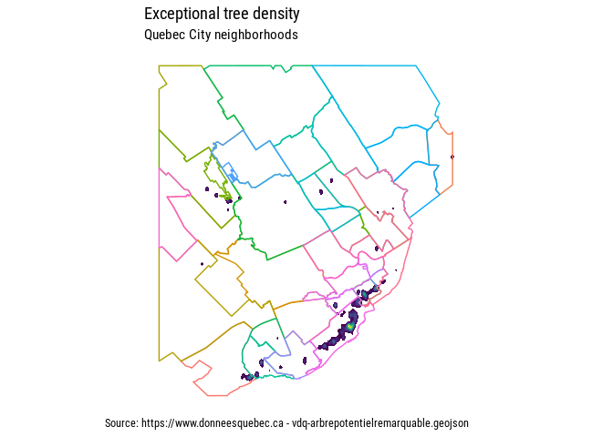

<!-- README.md is generated from README.Rmd. Please edit that file -->

# SfSpHelpers

<!-- badges: start -->

[](https://github.com/cgauvi/sfSpHelpers/actions)
<!-- badges: end -->

Basic `R` package to perform routine spatial operations

## Installation

You can install the development version of SfSpHelpers from
[GitHub](https://github.com/) with:

``` r
# install.packages("devtools")
devtools::install_github("cgauvi/sfSpHelpers")
```

## Example

For instance, create a 2D kernel density heatmap from a sf object with
POINT geometry to show the density of points. Can then easily be mapped
using mapview or ggplot2

``` r
library(SfSpHelpers)
#> Loading required package: magrittr
library(sf)
#> Linking to GEOS 3.9.1, GDAL 3.3.2, PROJ 7.2.1; sf_use_s2() is TRUE
library(ggplot2)

  #Trees
  shp_trees <-  st_read('https://www.donneesquebec.ca/recherche/dataset/bc5afddf-9439-4e96-84fb-f91847b722be/resource/bbdca0dd-82df-42f9-845b-32348debf8ab/download/vdq-arbrepotentielremarquable.geojson')
#> Reading layer `D:/fmeserver2017///resources/data/\DO\PUBLICATION\vdq-arbrepotentielremarquable.geojson' from data source `https://www.donneesquebec.ca/recherche/dataset/bc5afddf-9439-4e96-84fb-f91847b722be/resource/bbdca0dd-82df-42f9-845b-32348debf8ab/download/vdq-arbrepotentielremarquable.geojson' 
#>   using driver `GeoJSON'
#> Simple feature collection with 707 features and 11 fields
#> Geometry type: POINT
#> Dimension:     XY
#> Bounding box:  xmin: -71.41288 ymin: 46.73784 xmax: -71.15738 ymax: 46.93477
#> Geodetic CRS:  WGS 84
 
  #Neighborhoods
  shp_neigh <-  get_zipped_remote_shapefile("https://www.donneesquebec.ca/recherche/dataset/5b1ae6f2-6719-46df-bd2f-e57a7034c917/resource/508594dc-b090-407c-9489-73a1b46a8477/download/vdq-quartier.zip")
#> Reading layer `vdq-quartier' from data source `/tmp/RtmprGLW10' using driver `ESRI Shapefile'
#> Simple feature collection with 35 features and 4 fields
#> Geometry type: MULTIPOLYGON
#> Dimension:     XYZ
#> Bounding box:  xmin: -71.54908 ymin: 46.73355 xmax: -71.13833 ymax: 46.98074
#> z_range:       zmin: 0 zmax: 0
#> Geodetic CRS:  WGS 84

 #get_polygon_heatmap Works with polygons also (takes centroid implicitely)
  shp_polyons <- get_polygon_heatmap(shp_trees , bw=.001, gsize=500 )
#> Loading required package: sp
#> Loading required package: dplyr
#> 
#> Attaching package: 'dplyr'
#> The following objects are masked from 'package:stats':
#> 
#>     filter, lag
#> The following objects are masked from 'package:base':
#> 
#>     intersect, setdiff, setequal, union
#> Warning in st_centroid.sf(shp): st_centroid assumes attributes are constant over
#> geometries of x
#> Warning: The `x` argument of `as_tibble.matrix()` must have unique column names if `.name_repair` is omitted as of tibble 2.0.0.
#> Using compatibility `.name_repair`.
#> This warning is displayed once every 8 hours.
#> Call `lifecycle::last_lifecycle_warnings()` to see where this warning was generated.
 
#Can use the colors produced automatically, but this is a red to yellow gradient 
ggplot(shp_polyons)+
    geom_sf(aes( fill = colors),lwd=0) +
    scale_fill_viridis_d() +
    geom_sf(data=shp_neigh, aes(col=NOM),alpha=0) + 
    ggplot2::theme_minimal(base_family="Roboto Condensed", base_size=11.5) +
    theme(legend.position = 'none')
```


